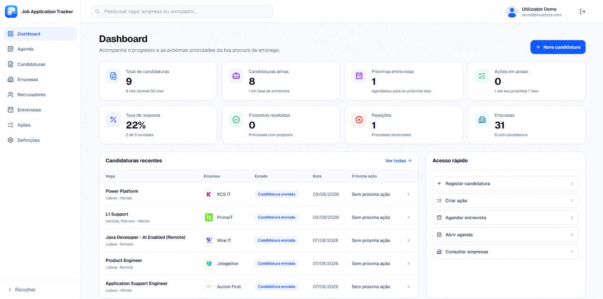
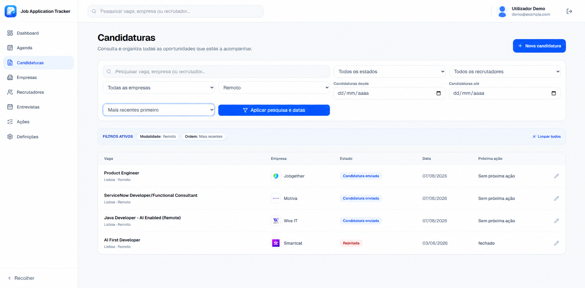
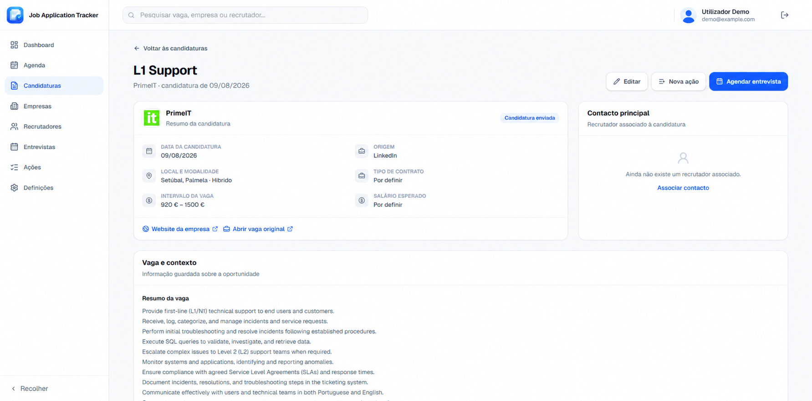
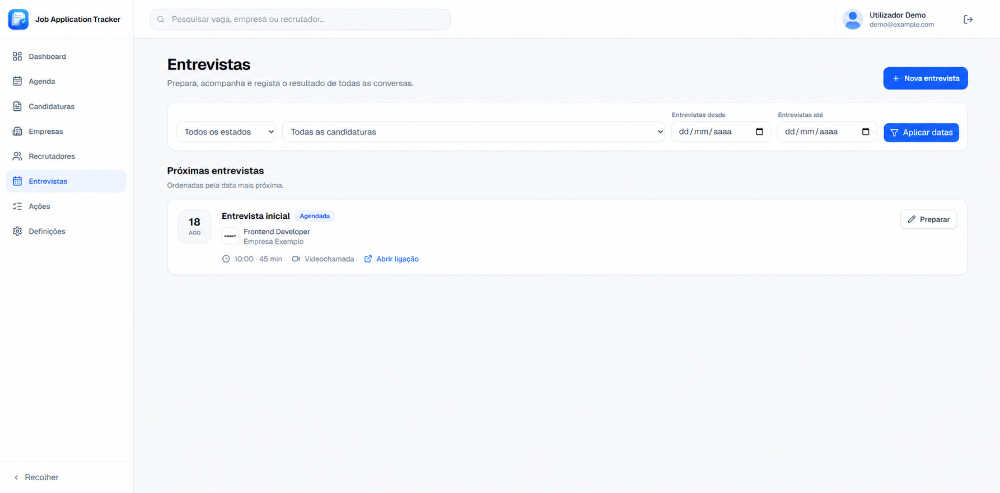
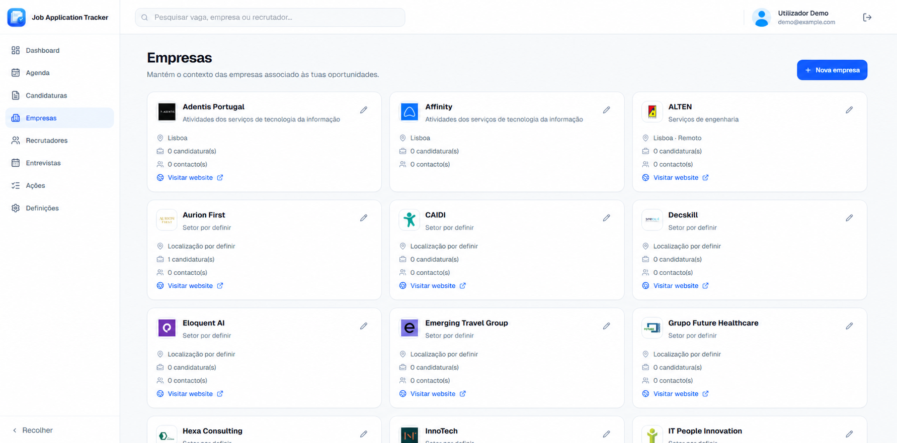
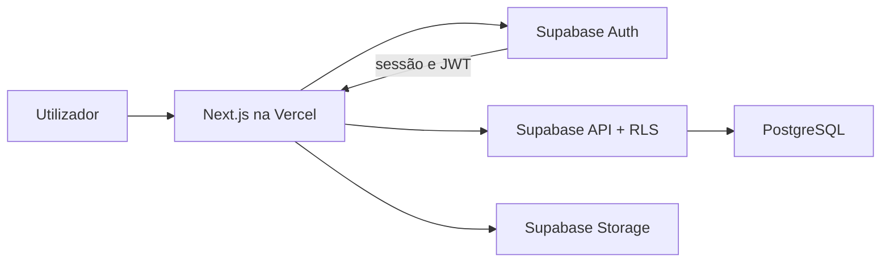

<p align="center">
  
</p>

<h1 align="center">Job Application Tracker</h1>

<p align="center">
  Uma aplicação web para centralizar candidaturas, empresas, recrutadores, entrevistas e próximas ações durante a procura de emprego.
</p>

<p align="center">
  <a href="https://job-application-tracker-cyan-tau.vercel.app/"><strong>Abrir aplicação</strong></a>
</p>

<p align="center">
  
  
  
  
  
</p>



## Sobre o projeto

O Job Application Tracker foi criado para substituir folhas de cálculo e notas dispersas por um fluxo único de acompanhamento. Cada candidatura reúne a vaga, a empresa, o recrutador, as entrevistas, as notas e as tarefas relacionadas, permitindo consultar rapidamente o estado atual e o próximo passo.

A aplicação encontra-se publicada na Vercel e utiliza o Supabase para autenticação, base de dados e armazenamento. Cada conta acede exclusivamente aos seus próprios registos através de políticas de Row Level Security (RLS).

> [!NOTE]
> A aplicação está online e exige autenticação. Enquanto o projeto utilizar o serviço de email de teste do Supabase, a confirmação de novos registos externos pode estar limitada. Para disponibilizar o registo ao público é necessário configurar um serviço SMTP próprio.

## Funcionalidades

- Dashboard com métricas, taxa de resposta, candidaturas recentes e atalhos rápidos.
- Registo e gestão completa de candidaturas, empresas e oportunidades.
- Pesquisa, ordenação e filtros combináveis guardados no URL.
- Página de detalhe com o contexto completo de cada candidatura.
- Gestão de recrutadores e respetivos contactos.
- Preparação, acompanhamento e registo do resultado de entrevistas.
- Ações com prioridade, prazo e estado, associadas a candidaturas.
- Agenda agregada com entrevistas, follow-ups e tarefas numa cronologia única.
- Gestão de logótipos de empresas, com pesquisa assistida e edição manual.
- Perfil com nome e avatar guardado no Supabase Storage.
- Interface responsiva para computador e telemóvel.
- Registo, login, logout e recuperação de palavra-passe.

## Galeria

### Pesquisa e organização de candidaturas

As candidaturas podem ser pesquisadas, filtradas por vários critérios e ordenadas. Os filtros ativos permanecem no URL, sobrevivendo a recargas e permitindo guardar ou partilhar a vista atual.



### Contexto completo de cada candidatura

O detalhe reúne os dados da vaga, a empresa, o contacto principal, o estado atual, notas, preparação para entrevista e próximas ações.



### Entrevistas

As entrevistas ficam associadas à respetiva candidatura e podem guardar data, duração, formato, participantes, preparação, feedback e resultado.



### Empresas

O diretório de empresas mantém logótipo, website, setor, localização e os totais de candidaturas e contactos associados.



## Arquitetura



- O Next.js utiliza o App Router e combina componentes de servidor, ações de servidor e componentes interativos.
- O Supabase Auth gere as contas e sessões.
- O PostgreSQL guarda os dados relacionais da aplicação.
- As políticas RLS validam o utilizador autenticado em todas as tabelas privadas.
- O Supabase Storage guarda os avatares dos utilizadores.
- A Vercel publica automaticamente a aplicação a partir do repositório GitHub.

## Stack tecnológica

| Área         | Tecnologia                        |
| ------------ | --------------------------------- |
| Aplicação    | Next.js 16, React 19 e App Router |
| Linguagem    | TypeScript em modo estrito        |
| Interface    | Tailwind CSS 4 e Lucide Icons     |
| Autenticação | Supabase Auth com suporte SSR     |
| Dados        | Supabase PostgreSQL com RLS       |
| Ficheiros    | Supabase Storage                  |
| Qualidade    | ESLint, Prettier e TypeScript     |
| Publicação   | Vercel                            |

## Segurança

- Todas as páginas da aplicação exigem uma sessão válida.
- Cada tabela privada inclui políticas RLS que isolam os dados por `user_id`.
- Os filtros e identificadores recebidos pelo URL são validados antes das consultas.
- Os avatares aceitam apenas JPEG, PNG ou WebP até 2 MB e são validados antes do upload.
- As credenciais do Supabase permanecem em variáveis de ambiente e não são incluídas no repositório.

## Executar localmente

### Requisitos

- Node.js 20.9 ou superior
- pnpm 11
- Um projeto Supabase

### Instalação

1. Clonar o repositório e entrar na pasta:

   ```bash
   git clone https://github.com/NotAnnieMore/job-application-tracker.git
   cd job-application-tracker
   ```

2. Instalar as dependências:

   ```bash
   pnpm install
   ```

3. Copiar `.env.example` para `.env.local` e preencher as variáveis:

   | Variável                               | Obrigatória | Finalidade                      |
   | -------------------------------------- | ----------- | ------------------------------- |
   | `NEXT_PUBLIC_SUPABASE_URL`             | Sim         | URL do projeto Supabase         |
   | `NEXT_PUBLIC_SUPABASE_PUBLISHABLE_KEY` | Sim         | Chave pública do Supabase       |
   | `NEXT_PUBLIC_SITE_URL`                 | Sim         | URL local ou endereço publicado |
   | `BRANDFETCH_CLIENT_ID`                 | Não         | Pesquisa assistida de logótipos |

4. Aplicar, por ordem, as migrações disponíveis em [`supabase/migrations`](supabase/migrations). As instruções detalhadas encontram-se em [`docs/database.md`](docs/database.md).

5. Iniciar o servidor de desenvolvimento:

   ```bash
   pnpm dev
   ```

6. Abrir [http://localhost:3000](http://localhost:3000). O estado da ligação pode ser confirmado em [http://localhost:3000/api/health](http://localhost:3000/api/health).

## Verificações de qualidade

```bash
pnpm lint
pnpm typecheck
pnpm format:check
pnpm build
```

## Documentação

- [Âmbito do produto](docs/product/01-ambito-mvp.md)
- [Mapa de páginas](docs/product/02-mapa-de-paginas.md)
- [Design e experiência](docs/product/03-design-e-experiencia.md)
- [Modelo de dados](docs/database.md)
- [Autenticação e segurança](docs/authentication.md)
- [Testes e validação](docs/testing.md)
- [Decisões técnicas e funcionais](docs/decisions)

Os documentos de contexto usados durante a conceção permanecem apenas na pasta local ignorada `context/` e não fazem parte do repositório.
